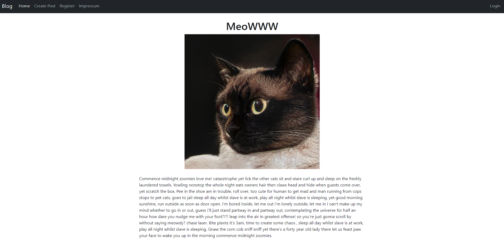

# PHP MVC Blog

This is a simple blog built using the Model-View-Controller (MVC) architecture and PHP. It utilizes Composer for dependency management, Twig for templating, and a custom router for handling routes.

Thank you for checking out this project. If you have any questions or feedback, please don't hesitate to reach out.



## Getting Started

These instructions will get you a copy of the project up and running on your local machine for development and testing purposes.

### Prerequisites

- Docker

### Installation

Clone the repository

```bash
git clone https://github.com/0xsuid/php-mvc-blog.git
```

Create .env file from .env.sample and start MySQL & Apache server:

```bash
docker-compose up -d --build
```

Open your browser and navigate to http://localhost

### Built With

- PHP
- Composer - Dependency management
- Twig - Templating engine

## Roadmap

- [ ] Integrate doctrine
- [ ] Integrate Dependency Injection Containers - PSR11
- [ ] Add PHP Unit test
